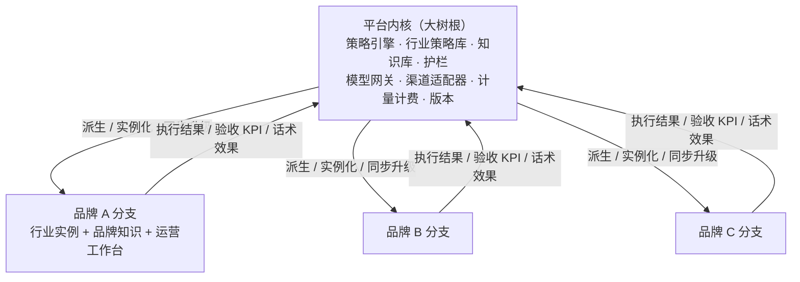

# 私域运营 Agent 中台 · 迭代方案（可执行版）

> 版本：v1.0 → v2.0  
> 定位：从“单系统运营中台”升级为“平台内核 + 品牌分支”的大树模型，策略引擎自动生长、跨行业复用。

## 一、现状盘点

### 1.1 已交付能力

- 指令中心：12 维结构化指令、飞轮洞察建议（信号/需求/货盘/策略）、一键转指令。
- 需求飞轮：热点采集（行业相关性过滤）、需求画像、货盘匹配、策略建议、自动闭环。
- 策略沉淀中心：结构化策略卡、从已验收指令一键沉淀、托管策略生成整月排期。
- 执行中心：活动/货盘/1v1/朋友圈/社群/短信/跟进模块化展示，模板配置 + 执行实例，排期日历，发送策略（时间窗/限频/暂停/补发），托管任务。
- 护栏：品牌违禁词 + 语境放行，命中自动拦截并告警。
- 知识库：多行业知识、美丽田园品牌资料、Second Brain 话术/卡项迁移，资产包自动检索真实素材。
- 多行业模板：美业、餐饮、零售、教育、宠物、大健康各一套默认模板。
- 验收：KPI 回填，报告自动生成“目标 / 实际 / 达成率”对比。
- 权限：admin / operator / viewer 三档，写操作前后端双重控制。
- 渠道：Mock 已通，企业微信、容联云短信适配器预留。
- 质量：21 项后端自动化测试覆盖全链路（指令 → 生成 → 审批 → 排期 → 自动下发 → 验收）。

### 1.2 当前架构事实

- 后端 FastAPI + SQLAlchemy + SQLite/PostgreSQL，前端 React + Vite。
- 多租户：`Tenant` = 客户；行业模板、知识库、护栏按租户/行业隔离。
- 本地 Ollama（nomic-embed + Qwen）可切换云端模型。
- 指令、渠道任务、排期待办、托管任务统一落在 `strategy_tasks`，由调度器自动下发。

### 1.3 主要差距

1. 策略只沉淀、不生长：验收 KPI 回填后没有回流成策略节点的效果权重。
2. 资产未分层：模板、知识、护栏仍是“按行业各存一份”，没有“平台级共享资产 + 品牌级实例”两层模型。
3. 无独立开发者后台：品牌管理、资产管理、计量对账、审计都还没有。
4. 无品牌分支机制：不能从平台快速派生、同步、升级、解约一个客户品牌。
5. 真实渠道与商业数据未接入：企微、容联云短信、巨量/小红书/抖音/蝉妈妈数据源待联调。
6. 飞书未接入：群聊/客服动作/运营效果无法实时回流，策略迭代缺少实时信号源。

## 二、目标架构：大树模型

**开发者管理后台 = 大树本体，客户品牌 = 树干/分支。分支共享树根，靠大树存活；大树靠分支的执行结果生长。**

### 2.1 三层模型

1. **平台内核（树根）**
   - 策略引擎：策略节点 + 效果权重 + 场景关联，自动生长。
   - 行业策略库：跨行业可复用的打法单元（破冰/逼单/召回/促活/种草/裂变…）。
   - 平台知识库、品牌违禁词规则、模型网关、渠道适配器。
   - 计量计费：按客户统计 LLM Token、触达量、发送成功率。
   - 飞书实时信号通道：群聊读取、客服动作监听、效果事件回流。
   - 开发者后台：品牌实例管理、资产版本、操作审计。
2. **品牌实例（分支）**
   - 从平台内核派生：行业 + 模板选择 + 品牌知识 + 违禁词 + 渠道配置 + 账号权限。
   - 策略 / 模板 / 知识默认平台级共享，品牌可覆盖私有内容；业务数据完全隔离。
   - 现有 Tenant 直接升级为品牌分支实例，避免数据迁移。
3. **回流闭环**
   - 分支执行 → 验收 KPI → 回写策略节点权重 → 跨品牌/跨行业复用 → 大树生长。

## 三、迭代路线图

### P1 平台内核与开发者后台（6-8 周）

**P1-1 策略引擎 v1：效果回流（第一个神经元）**
- 指令沉淀为策略卡时建立关联（`instruction → strategy`）。
- 验收 KPI 后回写策略卡：`runs / wins / score / last_kpi`。
- 飞轮建议按效果分排序，效果好的策略优先推荐。
- 验收口径：验收后策略卡 effect 字段更新，建议列表排序变化可见。

**P1-2 平台级资产模型**
- 行业模板、知识库、护栏升级为“平台级默认资产 + 品牌级覆盖实例”。
- 平台级资产可被多个品牌引用；品牌可覆盖个性化内容。
- 验收口径：新建品牌分支自动继承平台默认资产，覆盖不互相污染。

**P1-3 开发者管理后台**
- 仅内部使用；品牌管理：派生、启停、解约、版本。
- 资产管理：行业模板、策略卡、知识库、护栏的集中维护。
- 计量对账：按客户统计 LLM Token、短信条数、触达量、成功率，可导出。
- 操作审计：谁在什么时间改了什么。
- 验收口径：开发者后台可独立管理多个品牌实例，运营页面不受影响。

**P1-4 飞书实时效果回流**
- 飞书开放平台双向接入：读取群聊/客服消息/动作；从系统向飞书发消息、执行指令。
- 实时检测策略运营效果与客服动作（回复、邀约、成单标记、满意度），转成效果事件。
- 效果事件与验收 KPI 一起回流策略引擎，更新策略节点权重。
- 验收口径：飞书内客服动作/运营效果实时出现在策略卡效果记录，并影响飞轮建议排序。

### P2 品牌实例化与策略生长（6-8 周）

**P2-1 品牌分支机制**
- 现有 Tenant 直接升级为品牌分支实例；一键派生新分支；分支升级跟随平台版本；解约只停分支。
- 验收口径：新品牌 1 天内长出可用分支，平台升级全部品牌自动获得能力。

**P2-2 跨行业策略复用**
- 策略节点标注适用行业/场景/人群/渠道，按相似度推荐复用。
- AI 变异组合：自动组合已验证打法生成候选新策略，人工审核通过后进入策略库。
- 验收口径：A 行业验证的策略可被 B 行业品牌一键引用；AI 生成候选策略经人工审核后沉淀。

**P2-3 效果图谱**
- 策略节点 + 关联边（相似场景/上下游/替代关系），可视化。
- 验收口径：能看到“哪些策略被哪些品牌用过、效果如何、和谁相关”。

### P3 渠道与开放生态（6-8 周）

- P3-1 容联云短信真实发送（验证码/通知/营销模板）。
- P3-2 企业微信真实发送（客户联系 + 会话存档可选）。
- P3-3 商业数据源接入：巨量、小红书、抖音、蝉妈妈（按客户签约增购）。
- P3-4 开放 API 与外部客服桥接：第三方平台可推送信号、创建指令、查询执行结果。
- 验收口径：短信/企微真实触达可追踪发送 ID；外部平台可调用开放 API。

### P4 规模化与商业化（6-8 周）

- P4-1 多租户隔离强化、数据权限、安全合规。
- P4-2 按客户对账单与成本分摊（LLM/短信/渠道按客户计量）。
- P4-3 平台级经营驾驶舱（品牌数、活跃、成功率、成本、营收）。
- P4-4 运维体系：监控、告警、备份、灾备、灰度发布。
- 验收口径：多品牌并行运营，财务可出账，运维可无人值守。

## 四、里程碑与可演示结果

| 阶段 | 可演示结果 |
| --- | --- |
| P1-1 | 验收一个指令后，对应策略卡效果分上升，飞轮建议排序变化 |
| P1-2 | 两个不同行业品牌共享平台策略库，个性化覆盖不冲突 |
| P1-3 | 开发者后台派生新品牌，几分钟长出运营工作台 |
| P1-4 | 飞书客服动作/效果实时回流，策略卡效果记录可见 |
| P2-1 | 平台升级一次，全部品牌分支同步获得新能力 |
| P2-2 | 美业验证的打法一键复用到餐饮品牌 |
| P2-3 | 策略关系图谱展示复用与关联 |
| P3 | 短信/企微真实发送，巨量/小红书数据进入飞轮 |
| P4 | 多品牌并行、按月出账、平台驾驶舱 |

## 五、技术实现要点

- 数据模型：新增平台级 `Asset`/`StrategyNode` 概念；`Tenant` 直接升级为品牌分支实例并挂派生关系；策略卡增加 `effect_stats`。
- 资产规则：策略 / 模板 / 知识默认平台级共享，品牌级覆盖私有内容；业务数据按品牌完全隔离。
- 回流链路：`accept_instruction → update_strategy_effect → advisories 排序`。
- 前端：新增开发者后台路由；运营工作台保持现状，按品牌实例渲染。
- 测试：每个切片补自动化测试，保持全链路 E2E 可用。
- 版本：平台资产带 `version`，品牌实例记录 `applied_version`。

## 六、依赖与风险

- 渠道/数据源权限：巨量、小红书、抖音、蝉妈妈需服务商资质与正式报价。
- 飞书权限：自建应用需开通群聊/消息/审批相关权限，企业版按席位计费（可选）。
- 模型成本：随客户增长上升，靠预算上限 + 按客户计量控制。
- 合规：品牌违禁词、行业监管、客户数据隐私。
- 兼容：现有数据库与页面在两层化过程中保持向后兼容。

## 七、执行节奏建议

1. 先做 P1-1（策略效果回流），让“大树靠分支生长”闭环先跑起来。
2. 再做 P1-2 资产分层，P1-3 开发者后台。
3. P1 完成后立刻接 P2 品牌实例化，形成完整大树雏形。
4. P3/P4 按渠道授权与商业化节奏推进。
