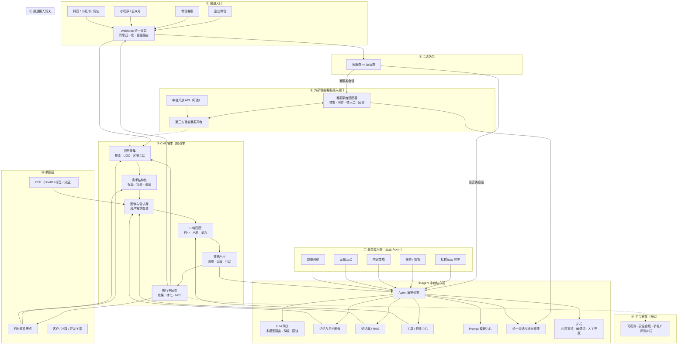

# 私域运营 Agent 中台 · 完整开发方案

> 版本：v1.0（已落地可运行闭环）  
> 状态：1.0 完成，进入精细化迭代  
> 范围：私域运营 Agent 中台，智能客服不自研，通过统一接口接入外部智能客服平台。

## 0. 当前落地状态

- 已实现：指令中心 12 维指令、策略资产包、审批后自动拆解 5 类渠道任务、整月排期生成与每分钟自动下发、发送策略（时间窗/限频/暂停/补发）、品牌违禁词语境放行、执行中心模块化（模板配置 + 执行实例）、多行业默认模板、角色权限、验收 KPI 回填与达成率对比。
- 数据资产：美丽田园品牌资料、Second Brain 话术/卡项、行业知识库已入库。
- 渠道：Mock 渠道已通，企业微信适配器预留，计划下一阶段接入真实企微。
- 待迭代：真实企微/短信发送、内容排期日历联动编辑、各行业深度资料、开放 API 与外部客服桥接联调。

## 1. 方案定位

### 1.1 目标

搭建一套可复用的私域运营 Agent 中台，让业务 Agent（社群运营、导购、内容、营销、数据洞察）共享同一套渠道接入、LLM、记忆画像、知识库、工具、护栏和运营闭环能力，避免每个业务重复造轮子。

### 1.2 边界

- 智能客服不纳入自研范围，通过「外部客服桥接层」接入第三方智能客服平台。
- 业务层聚焦运营类 Agent：社群运营 SOP、导购/销售、内容生成、营销活动、数据洞察。
- 中台核心新增「C+B 需求飞轮引擎」，把信号采集、需求结构化、画像与需求库、B 端匹配、策略产出、执行与回收串成完整运营闭环。

### 1.3 设计原则

- 渠道解耦：业务不感知渠道差异，换渠道不改业务。
- 中台复用：LLM、记忆、知识库、工具、护栏全部中台化。
- 客服外接：外部客服平台通过统一桥接协议接入，可替换、可多平台并存。
- 闭环优先：每个运营动作都回到数据，形成飞轮。
- 护栏先行：内容审核、敏感词、转人工是私域运营的生命线。
- 多云可移植：先本地 Docker 开发，后上腾讯云或其他云。

## 2. 总体架构



## 3. 关键技术决策

| 编号 | 决策 | 说明 |
| --- | --- | --- |
| D1 | 外部客服桥接层 | 定义统一 `Customer Service Bridge` 协议：双向消息、会话同步、转人工、事件回调。每个外部平台实现一个适配器，协议相同、平台可替换。 |
| D2 | 会话路由前置 | 渠道网关收口后先判断会话类型：客服类转外部平台，运营类进中台 Agent。 |
| D3 | 模块化单体起步 | P0 用「模块化单体」保证迭代速度，模块边界清晰，后续按压力拆服务，避免一开始就上微服务。 |
| D4 | LLM 网关抽象 | 统一 OpenAI 兼容协议，支持混元 / GPT / Claude / 通义等；按任务复杂度路由，主模型故障自动降级，全局 Token 预算。 |
| D5 | 编排先轻后重 | P0 自研轻量 DAG 编排 + Agent 注册表，预留替换为 LangGraph 等成熟编排引擎的空间。 |
| D6 | 需求飞轮 Pipeline 化 | 六环节各为一个可插拔 pipeline 节点，事件驱动触发，指标回流闭环。 |
| D7 | 护栏内建 | 敏感词、内容审核、幻觉检查、人工兜底作为消息出口前的强制节点。 |
| D8 | 统一事件模型 | 渠道消息、客服回调、行为埋点、飞轮指标都进统一事件流，便于观测和重放。 |

## 4. 技术选型

| 领域 | 选型 | 备注 |
| --- | --- | --- |
| 后端 | Python 3.12 + FastAPI + Pydantic v2 | 生态成熟，LLM/Agent 库丰富 |
| ORM/迁移 | SQLAlchemy 2 + Alembic | 数据模型统一管理 |
| 存储 | PostgreSQL 16（开发可用 SQLite） | 业务、会话、需求库 |
| 缓存/队列 | Redis（开发） | P0 用 Redis Streams，生产可换 CKafka/TDMQ |
| 向量检索 | pgvector 起步 | 生产可换腾讯云向量数据库 |
| LLM | LiteLLM / OpenAI 兼容 SDK | 多模型统一接入 |
| Agent 编排 | 自研轻量 DAG（预留 LangGraph） | 避免 P0 被框架绑架 |
| 管理台 | React + Vite + TypeScript | P0 最小化，P1 完善 |
| 测试 | pytest + httpx + Playwright | 单元、契约、端到端 |
| 本地部署 | Docker Compose | 一条命令起全套 |
| 生产部署 | TKE（K8s）/ SCF + IaC | P3 落地 |

## 5. 仓库结构与模块划分

```text
private-domain-platform/
├─ backend/
│  ├─ app/
│  │  ├─ main.py                 # FastAPI 入口
│  │  ├─ api/                    # REST 接口层
│  │  ├─ channels/               # 渠道网关：Webhook、归一化、路由
│  │  ├─ cs_bridge/              # 外部客服桥接层（核心新增）
│  │  ├─ flywheel/               # C+B 需求飞轮引擎（核心新增）
│  │  ├─ agents/                 # 业务 Agent：SOP / 导购 / 内容 / 营销 / 洞察
│  │  ├─ orchestration/          # Agent 编排引擎
│  │  ├─ llm_gateway/            # LLM 网关
│  │  ├─ memory/                 # 短期记忆 / 长期画像
│  │  ├─ knowledge/              # RAG：解析、切片、向量、检索
│  │  ├─ tools/                  # 工具注册与执行
│  │  ├─ guardrails/             # 护栏：敏感词、审核、转人工
│  │  ├─ core/                   # 领域模型、会话、租户、事件
│  │  └─ observability/          # 日志、追踪、指标
│  ├─ alembic/                   # 数据库迁移
│  └─ tests/
├─ web/                          # 管理台（React）
├─ deploy/                       # docker-compose、环境配置
├─ docs/                         # 方案、接口文档
└─ README.md
```

## 6. 核心数据模型（初版）

| 域 | 核心表 | 关键字段 |
| --- | --- | --- |
| 租户/权限 | `tenants`、`users`、`tenant_members` | 租户 ID、角色、权限 |
| 渠道 | `channels`、`channel_configs` | 渠道类型、凭证、回调地址 |
| 会话 | `conversations`、`messages` | 会话 ID、渠道、归一化消息、状态 |
| 客户 | `customers`、`customer_profiles` | OneID、标签、分层、画像 JSON |
| 飞轮-信号 | `demand_signals` | 信号来源、原始内容、渠道 |
| 飞轮-需求 | `demand_profiles`、`demand_graph` | 标签、场景、强度、需求关系 |
| 飞轮-匹配 | `capability_catalog` | 行业、产品、能力、匹配规则 |
| 飞轮-策略 | `strategies`、`strategy_executions` | 策略类型、参数、状态、执行结果 |
| 飞轮-指标 | `flywheel_metrics` | 闭环周期、命中率、采纳率、策略 ROI |
| 知识库 | `knowledge_docs`、`knowledge_chunks`、`embeddings` | 文档、切片、向量、版本 |
| 工具 | `tool_registry`、`tool_calls` | 工具名、Schema、调用日志 |
| Agent | `agent_defs`、`agent_runs` | Agent 定义、运行记录 |
| LLM | `llm_models`、`llm_call_logs` | 模型、路由规则、Token、延迟、成本 |
| Prompt | `prompt_templates`、`prompt_versions` | 模板、版本、灰度 |
| 护栏 | `guardrail_rules`、`guardrail_hits` | 规则、命中记录、处置动作 |
| 审计 | `audit_logs` | 操作人、动作、前后值 |

## 7. 关键业务流

### 7.1 消息接入与路由

1. 渠道 Webhook 收到消息，渠道网关按渠道签名校验。
2. 网关将渠道消息归一化为统一 `Message`，绑定会话。
3. 路由器判断会话类型：
   - 客服类：走 `cs_bridge`，转发给外部智能客服平台，并把外部平台回复回传渠道。
   - 运营类：走中台 Agent 编排。
4. 外部平台事件（转人工、会话结束、满意度）通过回调进入统一事件流。

### 7.2 C+B 需求飞轮闭环

1. 信号采集：渠道消息、搜索记录、UGC、客服会话、行为埋点进入 `demand_signals`。
2. 需求结构化：抽取标签、场景、需求强度，写入 `demand_profiles`。
3. 画像与需求库：与 CDP、记忆画像合并，构建用户需求图谱。
4. B 端匹配：在 `capability_catalog` 中匹配行业、产品、能力。
5. 策略产出：由 LLM/规则生成运营策略（SOP、内容、活动、导购动作）。
6. 执行与回收：编排引擎执行策略，效果/转化/NPS 数据回流，更新飞轮指标。

### 7.3 Agent 执行链路

策略或运营指令 → Agent 编排 → 选择 Agent → LLM 网关生成内容 → 工具调用（查商品、建活动、发消息）→ 护栏校验 → 渠道发送 → 结果回写。

## 8. API 规划（v1）

### 渠道与客服桥接

| 方法 | 路径 | 用途 |
| --- | --- | --- |
| POST | `/api/v1/channels/{channel}/webhook` | 渠道消息入口 |
| POST | `/api/v1/cs-bridge/sessions` | 创建/同步外部客服会话 |
| POST | `/api/v1/cs-bridge/events` | 接收外部客服事件回调 |
| POST | `/api/v1/cs-bridge/handoff` | 触发转人工 |

### 会话与客户

| 方法 | 路径 | 用途 |
| --- | --- | --- |
| GET | `/api/v1/conversations/{id}` | 会话详情 |
| GET | `/api/v1/conversations/{id}/messages` | 消息列表 |
| POST | `/api/v1/conversations/{id}/messages` | 主动发送消息 |
| GET | `/api/v1/customers/{id}/profile` | 客户画像 |

### 飞轮与运营

| 方法 | 路径 | 用途 |
| --- | --- | --- |
| POST | `/api/v1/flywheel/trigger` | 手动触发一轮飞轮 |
| GET | `/api/v1/flywheel/dashboard` | 飞轮指标看板 |
| GET | `/api/v1/flywheel/strategies` | 策略列表 |
| POST | `/api/v1/agents/{agent_id}/run` | 运行指定 Agent |

### 管理与配置

| 方法 | 路径 | 用途 |
| --- | --- | --- |
| CRUD | `/api/v1/knowledge/documents` | 知识库文档管理 |
| CRUD | `/api/v1/tools` | 工具注册 |
| CRUD | `/api/v1/llm/models` | 模型配置 |
| CRUD | `/api/v1/guardrails/rules` | 护栏规则 |
| GET | `/api/v1/admin/overview` | 管理台总览 |

## 9. 分阶段实施计划

### P0 · 最小可运行闭环（约 2-3 周）

目标：跑通「消息进入 → 路由 → 外部客服/运营 Agent → 回复」最小链路，并接入需求飞轮骨架。

交付：

- 项目骨架 + Docker Compose + 数据库迁移。
- 渠道网关：企业微信 Webhook 收口（本地提供 Mock 渠道）+ 消息归一化 + 会话持久化。
- 会话路由：客服类转外部平台、运营类进中台。
- 外部客服桥接：定义统一协议，先接 1 个平台适配器（平台待确认）。
- LLM 网关：单模型起步（OpenAI 兼容 / 混元）。
- 基础护栏：敏感词 + 转人工。
- 需求飞轮骨架：信号采集 → 需求库 → 策略执行 → 指标回收，最小链路可手工触发。
- 管理台最小版：会话查看、消息发送、护栏命中记录。
- 端到端验收：Mock 渠道消息可转到外部客服或运营 Agent 并回复；飞轮可手工触发一轮闭环。

### P1 · 能力成型（约 4 周）

目标：中台核心能力完整可用。

交付：

- 需求飞轮六环节完整化，自动信号采集、B 端匹配、用户需求图谱。
- RAG 知识库：文档解析、切片、向量化、检索、重排、版本与权限。
- 记忆与画像：短期会话记忆 + 长期用户画像，预留 CDP 接口。
- LLM 网关多模型路由、故障降级、Token 预算。
- 内容安全审核接入。
- 业务 Agent：社群运营 SOP、导购、内容生成。
- 管理台完善：知识库、策略、Agent、模型配置。

### P2 · 运营增强（约 4 周）

目标：数据驱动 + 成本可控。

交付：

- CDP 打通、行为埋点接入。
- 成本/质量/延迟监控，LLM 全链路追踪。
- 热点缓存、异步任务、弹性伸缩。
- 数据洞察 Agent、策略 ROI 报表、飞轮指标看板完善。

### P3 · 治理与规模化（约 4 周）

目标：安全合规、稳定可运维。

交付：

- 多租户隔离完善。
- IaC 部署、蓝绿发布。
- 混沌演练、评测流水线、A/B 实验。
- 生产环境部署（TKE、CKafka、向量库、内容安全）。

## 10. 测试与质量保障

- 单元测试：路由、飞轮各环节、护栏、记忆、工具调用。
- 契约测试：渠道适配器、外部客服适配器。
- 端到端测试：Mock 渠道 → 路由 → 客服/Agent → 回复。
- 评测：客服转出准确率、飞轮命中率/采纳率、内容合规率。
- 安全：PII 加密、最小权限、审计日志。

## 11. 风险与对策

| 风险 | 影响 | 对策 |
| --- | --- | --- |
| 外部客服平台接口差异大 | 桥接层开发成本上升 | 先定统一协议，适配器独立实现，按平台逐个接入 |
| 企微 API 限流/封号 | 私域渠道不可用 | 限流、退避重试、内容护栏、人工兜底 |
| LLM 成本失控 | 运营成本爆炸 | 模型路由、缓存、Token 预算、成本告警 |
| RAG 质量差 | Agent 回复不可靠 | 切片/检索/重排调优 + 评测流水线 |
| PII 泄露 | 合规事故 | 加密、脱敏、租户隔离、审计 |
| 需求飞轮变成摆设 | 数据闭环失效 | 指标回流强制接入，每周看板复盘 |

## 12. 需要确认的问题

1. ~~第一个外部智能客服平台是哪家？~~ 暂不确定，统一接口先留好，适配器按平台逐个接入。
2. ~~第一个渠道是否从企业微信开始？~~ 企业微信为主，本地开发同时提供 Mock 渠道。
3. ~~LLM 供应商？~~ 推荐混元（Hunyuan）为主，通过 OpenAI 兼容协议接入，预留 GPT/DeepSeek 等兜底模型。
4. ~~P0 是否需要管理台？~~ 需要，P0 交付最小管理后台。
5. ~~多租户是否从 P0 开始设计？~~ 是，数据模型与 API 从 P0 起带租户隔离。

## 13. 已确认决策（2026-08-14）

| 编号 | 决策 | 结论 |
| --- | --- | --- |
| C1 | 外部客服平台 | 暂不指定具体平台，`cs_bridge` 提供统一协议与通用 HTTP 适配器，后续按平台扩展 |
| C2 | 渠道 | 企业微信为主渠道，本地开发内置 Mock 渠道；管理后台可在 Mock 渠道直接演示 |
| C3 | LLM | 主模型推荐混元（Hunyuan-Pro），简单任务走轻量模型，OpenAI 兼容协议；兜底模型可配 DeepSeek / GPT |
| C4 | 管理后台 | P0 交付最小管理后台：总览、会话、需求飞轮、护栏、配置 |
| C5 | 多租户 | P0 起所有业务表带 `tenant_id`，API 通过 `X-Tenant-Id` 头隔离租户 |
| C6 | 部署 | 本地 Docker Compose 起步，生产 TKE 等后续阶段落地 |
| C7 | 增长智能内核 | 不替换中台，作为叠加层；三个一等公民原语：联邦智能层、因果归因引擎、生命周期编排层 |
| C8 | 落地顺序 | 中台先行（P0-P3），内核叠加（K1-K3）；联邦智能须有 2-3 个真实品牌参与后再启动 |

## 14. 增长智能内核（叠加层）

### 14.1 定位

增长智能内核不是替换当前中台，而是叠在中台之上，把别人抄不走的能力做成系统一等公民。业务 Agent 只通过「内核接口边界」消费内核输出的客户态、LTV 目标和 SOP 建议，不感知内核内部实现。

### 14.2 三个一等公民原语

| 原语 | 职责 | 边界 |
| --- | --- | --- |
| A · 联邦智能层 | 横向联邦学习 / 安全多方计算 / 差分隐私，跨品牌匿名聚合行为与迁移知识 | PII 不出域，不触碰品牌原始数据，不做单品牌实时推理 |
| B · 因果归因引擎 | 决策级归因：每个 Agent 动作 → 触发知识 + 客户态变化 + 对复购/留存的因果贡献（uplift / 反事实） | 异步批处理，不阻断主对话链路 |
| C · 生命周期编排层 | 客户态状态机 + 以 LTV 为全局目标的 Agent 网络调度 | 不绑定渠道，渠道由中台渠道网关处理 |

配套能力：自进化 Playbook 库。归因与联邦信号持续改写 SOP，使知识从静态 RAG 升级为动态知识；RAG 仍保留事实、商品、政策类知识。

### 14.3 与现有系统结合映射

| 现有系统 | 增长智能内核 | 结合方式 |
| --- | --- | --- |
| 渠道网关 + 外部客服桥接 | 生命周期编排层 | 渠道与客服仍走现有网关，内核不碰渠道 |
| Agent 编排引擎 | 生命周期编排层 | 调度目标从“回复消息”升级为“完成 LTV 目标” |
| 需求飞轮画像/需求库 | 客户态状态机 | 飞轮画像写入客户态，客户态回写飞轮 |
| 需求飞轮策略产出 | 自进化 Playbook | 策略从固定模板升级为被归因结果持续改写 |
| 策略执行 / Agent 运行 / 飞轮指标 | 因果归因引擎 | 执行日志与效果数据成为归因输入，归因 API 反哺策略 |
| 多租户 | 联邦智能层 | 品牌 = 租户，租户内 PII 不出域，只上送匿名特征/梯度 |
| 知识库 RAG | Playbook 库 | 事实知识留 RAG，运营策略进 Playbook，分工协作 |

### 14.4 内核接口边界（建议 API）

- `customer-state`：客户态读写。
- `ltv-goal`：LTV 目标查询与更新。
- `sop-suggest`：个性化 SOP 建议（供业务 Agent 调用）。

### 14.5 收益

- 从“运营工具”升级为“增长系统”：Agent 围绕客户 LTV 协同，而非只做对话。
- 飞轮真正自进化：闭环周期、命中率、采纳率、策略 ROI 变成归因观测指标。
- ROI 可证明：回答“哪个 SOP/动作真正带来复购留存”。
- 合规差异化：租户隔离 + PII 不出域 + 联邦聚合，形成竞品难复制的合规底座。
- 现有投入全部保留：渠道、客服桥接、LLM 网关、RAG、护栏无需推翻。

### 14.6 成功概率与困难点

成功概率（诚实评估）：

- 完整系统（三原语 + 跨品牌联邦 + 因果归因被业务验证）：约 25%-35%。
- 内核 MVP（生命周期编排 + 简化归因 + Playbook 自更新，单品牌跑通）：约 60%-70%。

主要困难点：

- 因果归因：需要真实转化/复购/留存结果，反馈周期长，冷启动数据不足。
- 联邦智能：依赖多品牌统一口径上送匿名数据，需数据协议与合规评审，周期不可控。
- 生命周期编排：客户态定义、LTV 预测、跨品牌状态机统一难度大，过度自动化有体验风险。
- 数据冷启动：绿地系统暂无真实会话、交易、复购数据。
- 人才与算力：因果推断、隐私计算、ML 工程稀缺，训练成本需控。
- 范围失控：中台 + 飞轮 + 内核同时铺开风险高，必须两层分阶段。

## 15. 两层落地路线图（中台先行 · 内核叠加）

### 第一层：中台 P0-P3

即本文第 9 节路线，先跑通渠道、客服桥接、LLM 网关、需求飞轮、护栏、多租户与数据闭环。

### 第二层：增长智能内核 K1-K3

| 阶段 | 目标 | 交付 |
| --- | --- | --- |
| K1 · 内核地基 | 生命周期编排先跑起来 | 内核接口边界三套 API、客户态状态机、LTV 目标调度、业务 Agent 消费内核输出 |
| K2 · 自进化 | 策略可被数据持续改写 | 简化因果归因（MTA/归因逻辑先行）、自进化 Playbook、策略 A/B、飞轮增益度量 |
| K3 · 联邦智能 | 跨品牌匿名聚合形成底座 | 联邦学习/多方计算/差分隐私、跨品牌迁移知识、独立审计；前置条件：2-3 个品牌签约与合规评审 |

### 并行准备

- P2 起在数据模型中预留内核字段与事件：客户态、LTV 目标、action 日志、业务结果事件。
- P3 起评估联邦层数据协议与合规模板，不等到 K3 才启动法务与数据治理。
- K1 与中台 P2 可并行；K2 依赖飞轮指标累积；K3 依赖品牌生态就绪。

## 16. 1.0 版本定义（2026-08-14）

### 16.1 1.0 目标

先交付一个“从信号到运营动作全自动”的完整可运行版本，再逐个模块精细化。

### 16.2 1.0 已具备

- 渠道网关（Mock）+ 外部客服桥接接口。
- LLM 网关：本地 Qwen（Ollama）+ 云端模型可切换。
- RAG 知识库与品牌资料。
- 客户画像与多租户。
- 需求飞轮 9 个子页：工作台、信号、需求、供给、匹配、策略、驾驶舱、接口、汇报。
- 策略中心：创建、托管、下发、任务流转。
- 护栏：敏感词、品牌违禁词、渠道质检。
- 实时热点采集（微博/百度/B 站）。

### 16.3 1.0 待完成

| 优先级 | 事项 | 说明 |
| --- | --- | --- |
| P0 | 自动化引擎 | 实时信号闭环、托管策略自动执行推送、定时 SOP、自动跟进与效果回收 |
| P0 | 开放接口完整化 | `/api/v1/signals`、`strategies`、`tasks`、`feedback`、`agent/bridge` 真实可用 |
| P0 | 渠道推送打通 | Mock 渠道端到端自动推送，企微适配器保留 |
| P0 | 1.0 验收测试 | 端到端自动化测试 + `docker compose` / `start-dev.sh` 一键启动 |
| P1 | 交付物 | README 1.0 说明、数据库迁移、示例数据、版本号 |

### 16.4 1.0 明确不做（留到 1.1 / 2.0）

- 真实企微/外部客服平台对接（接口保留）。
- CDP / 订单 / CRM 真实数据对接。
- 因果归因、联邦智能、生命周期内核 K1-K3。
- 多租户完整权限体系。

## 17. 多行业代运营底座（1.1）

### 17.1 定位

系统定位升级为“代运营公司多行业运营中台”：一个底座，多行业适配，每个客户独立指令/审批/执行/验收流程。

### 17.2 行业维度

首批支持行业：美业、餐饮、零售、教育、宠物、大健康。

每个行业通过「行业配置中心」定义：

- 货盘模板：引流款/主推款/利润款/组合卡，价格、成本、毛利、库存。
- 活动类型库：会员日、裂变、直播、节庆、新品、周年庆、复购召回、拉新等，按行业配置。
- 销售执行包：话术、跟进节奏、异议处理、客户分层打法。
- 内容排期：渠道、素材、发布节奏。
- KPI 口径：GMV、复购、ROI、NPS 等。

### 17.3 指令闭环

人发指令 → 系统结合行业模板、客户货盘、信号、知识库自动产出「策略资产包」→ 人审批 → 系统自动执行回收 → 人验收。

### 17.4 数据接入

货盘等数据以表格/文档形式提供，先做 Excel/CSV/文档导入，后续再对接客户系统 API。
